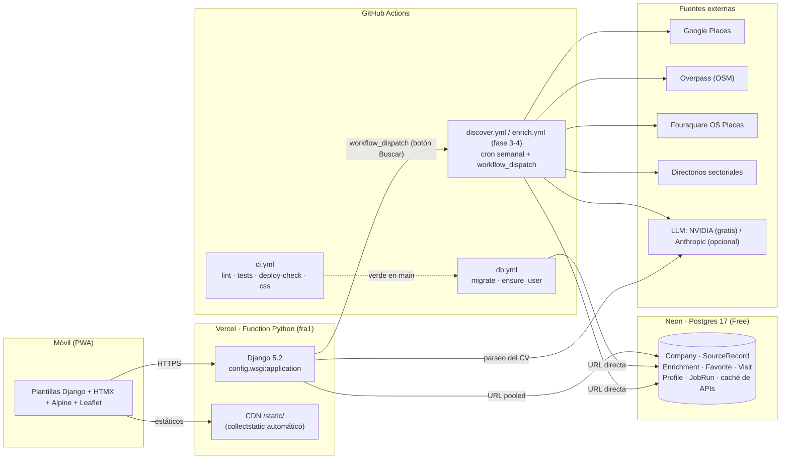

# Picaporte

> Empresas de Barcelona donde llamar a la puerta con tu CV en la mano.

Picaporte es una app web personal (un solo usuario) para una recién graduada en Publicidad y
RRPP: descubre empresas del sector en Barcelona —tengan o no ofertas publicadas—, las prioriza
según su perfil, guarda favoritas, planifica rutas de visita y hace seguimiento de cada entrega.
Está pensada para usarse desde el móvil, caminando por la ciudad, y se instala como PWA.

Es también un proyecto de portfolio: código limpio, tests, decisiones documentadas y coste de
hosting **0 €**.

| Estado | Fase |
|--------|------|
| ✅ Hecha | **1 · Esqueleto**: Django 5.2, settings por entorno, Neon, Vercel, `/health`, login, CI, design system y `/styleguide`, PWA |
| ✅ Hecha | **2 · Perfil**: CV en PDF guardado en Neon (≤ 4 MB), parseo con un LLM gratuito (NVIDIA, JSON guiado + Pydantic, caché por hash; Claude opcional), perfil editable y preferencias (categorías, zonas, tamaño, idiomas, intereses) |
| ⏳ Pendiente | 3 · Descubrimiento multi-fuente (Google Places, Overpass, Foursquare OS Places, directorios) con deduplicación |
| ⏳ Pendiente | 4 · Enriquecimiento (fetch web + Claude Haiku + Pydantic) y `fit_score` |
| ⏳ Pendiente | 5 · UI principal: Explorar, Mapa, ficha, Favoritas, tracker |
| ⏳ Pendiente | 6 · Ruta del día con Google Maps |
| ⏳ Pendiente | 7 · Ofertas (import desde career-ops) |

## Arquitectura



Principios: **nada largo dentro de una request** (todo el trabajo pesado corre en Actions),
**nada se envía automáticamente a empresas**, y **toda respuesta de API o fetch web se cachea
en la base de datos**.

## Decisiones técnicas

Las decisiones con contexto y consecuencias están en [`docs/adr/`](docs/adr/):

| ADR | Decisión |
|-----|----------|
| [0001](docs/adr/0001-django-52-python-312-uv.md) | Django 5.2 LTS, Python 3.12 y **uv** con `uv.lock` compartido por local, CI y Vercel |
| [0002](docs/adr/0002-vercel-zero-config-y-estaticos.md) | **Vercel zero-config** para Django; estáticos desde el CDN con WhiteNoise manifest; CSS compilado versionado |
| [0003](docs/adr/0003-neon-pooled-directa-y-migraciones-en-actions.md) | Neon: URL *pooled* en Vercel, *directa* en Actions; **migraciones en GitHub Actions**, nunca en Vercel |
| [0004](docs/adr/0004-login-usuario-unico.md) | Login de usuario único con `LoginRequiredMiddleware` (falla cerrado) y comando `ensure_user` idempotente |
| [0005](docs/adr/0005-tailwind-v4-y-paleta-aa.md) | **Tailwind v4** standalone con tokens en CSS; paleta con contraste **AA verificado en tests** |
| [0006](docs/adr/0006-pwa-minima.md) | PWA mínima: manifest + iconos + service worker solo para el fallback offline |
| [0007](docs/adr/0007-nada-largo-en-una-request.md) | Nada largo en una request: workers en Actions (`maxDuration` acotado) |
| [0008](docs/adr/0008-parseo-de-cv-en-request-y-cache-llm.md) | **LLM gratuito** (NVIDIA, OpenAI-compatible) con proveedores intercambiables; parseo del CV **en la request** (excepción acotada: una llamada, 120 s) y **caché de llamadas** por hash con contabilidad de coste |

### Estructura del repositorio

```
config/            settings/{base,local,production,test}.py · urls · wsgi · logs
apps/core/         health, pestañas, styleguide, PWA, design.py (tokens + contraste), templatetags/ui.py
apps/accounts/     login/logout, management/commands/ensure_user.py
apps/catalog/      Category y Zone configurables en BD (sembradas por migración)
apps/llm/          capa común (caché por hash, LLMCall con tokens y coste) + providers/ (nvidia gratuito, anthropic opcional)
apps/profiles/     Profile + CVDocument (PDF en bytea), servicios de subida y parseo, formulario móvil
templates/         base.html · components/ (bottom nav, badge, chip, skeleton, empty state, toast, field, action bar, sprite de iconos)
assets/tailwind/   input.css + theme.css (fuente del CSS; no se sirve)
static/            css/app.css (compilado) · fonts/ · vendor/alpine.min.js · icons/
scripts/           tw.py (Tailwind standalone) · make_icons.py (PNG desde SVG)
prompts/           prompts versionados de la Anthropic API (`cv_parse_v1.md`, …)
docs/adr/          decisiones de arquitectura
.github/workflows/ ci.yml · db.yml
```

Estructura prevista para las fases 3-7: `apps/companies` (Company, SourceRecord, adaptadores
`SourceAdapter` → `RawCompany`), `apps/enrichment`, `apps/tracking` (Favorite, Visit),
`apps/routes`, `apps/offers` y `apps/jobs` (JobRun + disparo de workflows). `apps/core` se
mantiene transversal.

### Perfil y parseo del CV (fase 2)

1. El PDF (≤ 4 MB por el límite de body de Vercel) se valida por cabecera `%PDF-` y se guarda
   en Neon como `bytea` (`CVDocument`); solo se conserva el actual.
2. "Analizar con IA" extrae el texto del PDF (`pypdf`) y lo envía al LLM gratuito de NVIDIA
   (`google/gemma-4-31b-it`, API OpenAI-compatible) pidiendo JSON según el esquema
   de `ParsedCV` (Pydantic); si no valida, se pide una corrección. Con `LLM_PROVIDER=anthropic`
   el PDF viaja como documento a Claude Haiku con *structured outputs*. El prompt vive en
   [`prompts/cv_parse_v1.md`](prompts/cv_parse_v1.md).
3. Cada llamada queda en `LLMCall` con su hash de entrada, tokens y coste: repetir el análisis
   del mismo CV con el mismo prompt no llama a la API.
4. El resultado rellena solo los campos vacíos del perfil (o todo, si se marca "Sobrescribir");
   después la usuaria edita lo que quiera y fija sus preferencias con chips.

### Design system

Tokens en [`assets/tailwind/theme.css`](assets/tailwind/theme.css) y catálogo vivo en
`/styleguide` (público). Paleta azul pastel: fondo `#F5F9FF`, superficie `#FFFFFF`, primario
pastel `#BFD7FF`, acción `#5B8DEF` (iconos, bordes, focus, texto grande), acción rellena
`#3A6BD0` (botones con texto blanco, 5,01:1), texto `#1E293B`, secundario `#64748B`, estados
en pastel. Tipografía Plus Jakarta Sans (variable, autoalojada). Componentes como
`` / `` (`simple_block_tag` de Django 5.2) e `` de parciales.
Todos los pares texto/fondo se comprueban contra WCAG AA en `apps/core/tests/test_design.py`.

## Setup local

Requisitos: Python 3.12 (`py -3.12` en Windows) y [uv](https://docs.astral.sh/uv/).

```bash
# 1. uv (Windows: winget install astral-sh.uv · o bien: py -3.12 -m pip install uv)
uv sync                                   # crea .venv con Python 3.12 y todas las dependencias
cp .env.example .env                      # ajusta PICAPORTE_PASSWORD

# 2. Base de datos (SQLite en local) y usuario
uv run python manage.py migrate
uv run python manage.py ensure_user       # lee PICAPORTE_USER/PASSWORD/EMAIL del .env

# 3. CSS (descarga el binario de Tailwind v4.3.3 a .tools/ la primera vez, sha256 verificado)
uv run python scripts/tw.py build         # o `watch` mientras editas plantillas

# 4. Servidor
uv run python manage.py runserver
```

Rutas útiles: `http://localhost:8000/health`, `/login/`, `/styleguide`.

```bash
uv run pytest                              # tests (SQLite en memoria)
uv run ruff check . && uv run ruff format .
uv run pre-commit install                  # opcional: ruff antes de cada commit
```

Para correr los tests contra Postgres en local, define `TEST_DATABASE_URL` (se usa una variable
distinta de `DATABASE_URL` para que un `.env` apuntando a Neon nunca afecte a los tests).

## Despliegue

1. **Neon** — crea un proyecto (Free, Postgres 17, región `aws-eu-central-1` Frankfurt). Copia
   las dos cadenas de conexión: *pooled* (`…-pooler…`) y *directa*.
2. **Vercel** — importa el repositorio (cuenta personal; Hobby no admite repos de organización).
   El preset *Django* se detecta solo; deja Build/Install/Output vacíos. Variables (Production
   y Preview):

   | Variable | Valor |
   |----------|-------|
   | `DJANGO_SETTINGS_MODULE` | `config.settings.production` |
   | `SECRET_KEY` | 50+ caracteres aleatorios |
   | `DATABASE_URL` | URL **pooled** de Neon (`?sslmode=require`) |
   | `NVIDIA_API_KEY` | clave `nvapi-…` gratuita de [build.nvidia.com](https://build.nvidia.com) (parseo del CV) |

   Comprueba que *Expose System Environment Variables* está activo (así `ALLOWED_HOSTS` y
   `CSRF_TRUSTED_ORIGINS` se derivan de `VERCEL_URL`). La región de la función (`fra1`) la fija
   `vercel.json`.
3. **GitHub** — crea el environment `production` con los secretos `DATABASE_URL` (URL
   **directa** de Neon), `SECRET_KEY`, `PICAPORTE_USER`, `PICAPORTE_PASSWORD` y
   `PICAPORTE_EMAIL`:

   ```bash
   gh secret set DATABASE_URL --env production
   ```

4. Lanza el workflow **DB (migraciones en Neon)** con *Run workflow* (la primera ejecución
   automática falla mientras no existan los secretos). A partir de ahí se ejecuta solo tras cada
   CI verde en `main`.
5. Abre `https://<proyecto>.vercel.app/health` → `{"status": "ok", "db": "ok", …}` y entra en
   `/login/`. En el móvil, *Añadir a pantalla de inicio* instala la PWA.

### Variables de entorno

| Variable | Local (`.env`) | Vercel | GitHub Actions (`production`) |
|----------|:-:|:-:|:-:|
| `DJANGO_SETTINGS_MODULE` | `config.settings.local` | `config.settings.production` | fijada en el workflow |
| `SECRET_KEY` | cualquiera | ✅ | ✅ |
| `DATABASE_URL` | `sqlite:///db.sqlite3` | pooled | **directa** |
| `ALLOWED_HOSTS` / `CSRF_TRUSTED_ORIGINS` | — | opcional (dominio propio) | — |
| `PICAPORTE_USER` / `PICAPORTE_PASSWORD` / `PICAPORTE_EMAIL` | ✅ | — | ✅ |
| `TEST_DATABASE_URL` | opcional | — | CI (Postgres 17) |
| `NVIDIA_API_KEY` (+ `LLM_PROVIDER`, `LLM_MODEL`, `LLM_TIMEOUT` opcionales) | opcional | ✅ | fase 4 |
| `ANTHROPIC_API_KEY` (solo con `LLM_PROVIDER=anthropic`) | opcional | opcional | opcional |
| `GOOGLE_PLACES_API_KEY`, `FOURSQUARE_API_KEY`, `GITHUB_TOKEN` | fases 3-4 | fase 3 (`GITHUB_TOKEN`) | fases 3-4 |

### CI

`ci.yml` corre en cada push y PR: **lint** (ruff check + format, `uv lock --check`), **tests**
(pytest contra Postgres 17 con `makemigrations --check`), **deploy-check** (`check --deploy
--fail-level WARNING` y `collectstatic` con storage manifest, como hace el build de Vercel) y
**css** (recompila Tailwind y falla si `static/css/app.css` no está al día). `db.yml` migra Neon
tras un CI verde en `main`.

## Coste de APIs por cada 100 empresas

| Concepto | Llamadas / 100 empresas | Precio unitario | Coste |
|----------|:-:|:-:|:-:|
| Google Places · Text Search | se completa en fase 3 | | |
| Google Places · Place Details | se completa en fase 3 | | |
| Overpass API (OSM) | — | gratis | 0 € |
| Foursquare OS Places | — | dataset abierto | 0 € |
| Directorios sectoriales (scraping) | — | gratis | 0 € |
| Fetch de webs (≤ 5 páginas/dominio) | ≤ 500 | gratis | 0 € |
| LLM · parseo del CV (una vez por CV) | 1-2 | NVIDIA gratuito (Claude Haiku opcional: ~0,01 $) | **0 €** |
| LLM · extracción | se completa en fase 4 | NVIDIA gratuito | 0 € |
| LLM · scoring | se completa en fase 4 | NVIDIA gratuito | 0 € |
| **Hosting** (Vercel Hobby + Neon Free + Actions) | | | **0 €** |

Toda respuesta se cachea en la base de datos (`LLMCall` guarda hash, tokens y coste real de cada
llamada); recalcular el `fit_score` al cambiar el perfil no repite ningún fetch.

## Limitaciones conocidas

- Vercel limita el body de request/response a **4,5 MB**: el CV se limitará a 4 MB (fase 2).
- Neon Free suspende el compute tras 5 min sin uso: la primera petición tras una pausa tarda
  ~1 s más. `/health` sirve de calentamiento.
- Neon Free ofrece 0,5 GB: la caché de fetches se comprimirá y purgará (fase 3-4).
- Los *preview deployments* de Vercel comparten la base de datos de producción y están
  protegidos por Vercel Authentication.
- Docker para desarrollo local llegará en una fase posterior (no había Docker en la máquina de
  desarrollo para verificarlo).

## Licencia

MIT. Terceros: Plus Jakarta Sans (OFL, `static/fonts/OFL.txt`), Lucide (ISC), Alpine.js (MIT)
y htmx (BSD) — ver [`static/vendor/LICENSES.md`](static/vendor/LICENSES.md).
