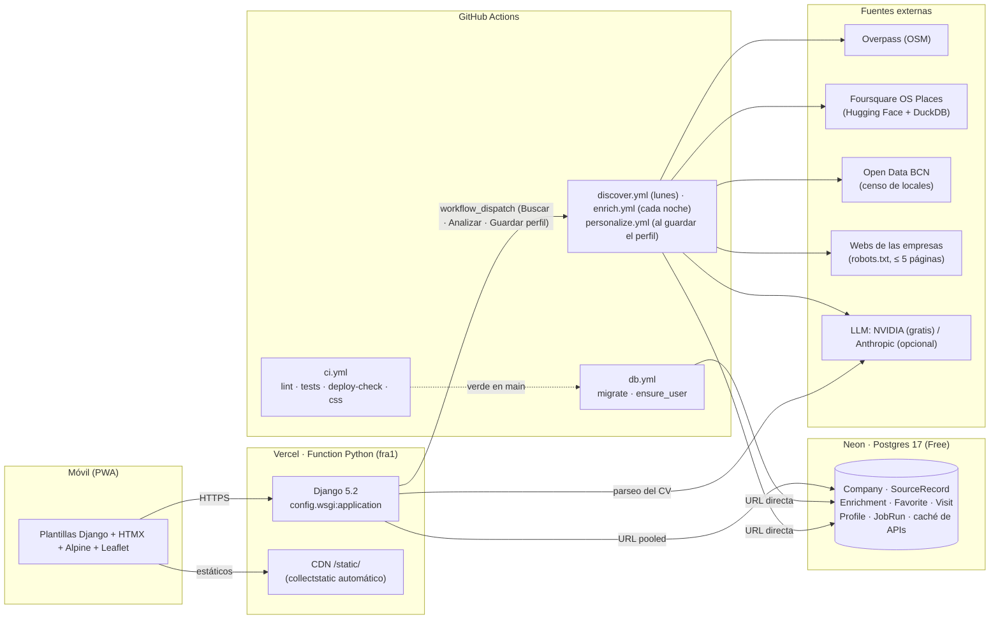

# Picaporte

> Empresas de Barcelona donde llamar a la puerta con tu CV en la mano.

Picaporte es una app web (con registro abierto: cada cuenta tiene su propia búsqueda) pensada para una recién graduada en Publicidad y
RRPP: descubre empresas del sector en Barcelona —tengan o no ofertas publicadas—, las prioriza
según su perfil, guarda favoritas, planifica rutas de visita y hace seguimiento de cada entrega.
Está pensada para usarse desde el móvil, caminando por la ciudad, y se instala como PWA.

Es también un proyecto de portfolio: código limpio, tests, decisiones documentadas y coste de
hosting **0 €**.

| Estado | Fase |
|--------|------|
| ✅ Hecha | **1 · Esqueleto**: Django 5.2, settings por entorno, Neon, Vercel, `/health`, login, CI, design system y `/styleguide`, PWA |
| ✅ Hecha | **2 · Perfil**: CV en PDF guardado en Neon (≤ 4 MB), parseo con un LLM gratuito (NVIDIA, JSON guiado + Pydantic, caché por hash; Claude opcional), perfil editable y preferencias (categorías, zonas, tamaño, idiomas, intereses) |
| ✅ Hecha | **3 · Descubrimiento multi-fuente**: OpenStreetMap (Overpass), Foursquare OS Places (DuckDB sobre el parquet de Hugging Face) y el censo municipal de locales (Open Data BCN); dedupe/fusión, `confidence_score`, ingesta por lotes, retirada de lo que desaparece, workflow semanal + botón "Buscar nuevas empresas" con estado en la UI. Sin Google Places ni directorios con anti-bot (ADR 0009) |
| ✅ Hecha | **4 · Enriquecimiento**: rastreo educado de la web (≤ 5 páginas, robots.txt, pausas), extracción y puntuación de encaje con IA gratuita en dos etapas (Pydantic, prompts versionados, caché por hash), gancho para presentarse, "Recalcular encaje" al cambiar el perfil sin volver a leer webs; cada noche en Actions (ADR 0010) |
| ✅ Hecha | **5 · UI principal**: Explorar con filtros (encaje, categoría, zona, estado, abierto ahora, catalán, confianza, favoritas) y paginación HTMX, Mapa (Leaflet), ficha con acciones de un toque, Favoritas con prioridad y arrastrar para ordenar, estados, notas y próximas acciones (ADR 0011) |
| ✅ Hecha | **6 · Ruta**: día, zona y franja → 6-10 empresas abiertas priorizando favoritas y encaje, ordenadas a pie (vecino más cercano + 2-opt), enlace de Google Maps (y por tramos para el navegador móvil) y modo ruta para marcar paradas (ADR 0012) |
| ✅ Hecha | **7 · Ofertas**: importación del `scan-history.tsv` de career-ops (o CSV/JSON), cruce con las empresas por dominio, nombre o parecido estricto, filtro e insignia "ofertas activas" en Explorar y lista en la ficha (ADR 0013) |
| ✅ Hecha | **Búsqueda personalizada**: la IA propone sectores desde el CV, guardar el perfil lanza la búsqueda y la puntuación, ranking por criterios con veredicto, limpieza de fuentes (término municipal, imprentas, coworkings, falsos positivos) y rutas de hasta 20 paradas editables (ADR 0014) |
| ✅ Hecha | **Multiusuario**: registro abierto (`/registro/`, tope `MAX_USERS`); catálogo de empresas común y perfil, ranking, favoritas, visitas, notas, rutas y ofertas de cada cuenta; cupos diarios de IA y de búsquedas (ADR 0015) |

## Arquitectura



Principios: **nada largo dentro de una request** (todo el trabajo pesado corre en Actions),
**nada se envía automáticamente a empresas**, y **toda respuesta de API o fetch web se cachea
en la base de datos**.

## Decisiones técnicas

Las decisiones con contexto y consecuencias están en [`docs/adr/`](docs/adr/):

| ADR | Decisión |
|-----|----------|
| [0001](docs/adr/0001-django-52-python-312-uv.md) | Django 5.2 LTS, Python 3.12 y **uv** con `uv.lock` compartido por local, CI y Vercel |
| [0002](docs/adr/0002-vercel-zero-config-y-estaticos.md) | **Vercel zero-config** para Django; estáticos desde el CDN con WhiteNoise manifest; CSS compilado versionado |
| [0003](docs/adr/0003-neon-pooled-directa-y-migraciones-en-actions.md) | Neon: URL *pooled* en Vercel, *directa* en Actions; **migraciones en GitHub Actions**, nunca en Vercel |
| [0004](docs/adr/0004-login-usuario-unico.md) | Login de usuario único con `LoginRequiredMiddleware` (falla cerrado) y comando `ensure_user` idempotente |
| [0005](docs/adr/0005-tailwind-v4-y-paleta-aa.md) | **Tailwind v4** standalone con tokens en CSS; paleta con contraste **AA verificado en tests** |
| [0006](docs/adr/0006-pwa-minima.md) | PWA mínima: manifest + iconos + service worker solo para el fallback offline |
| [0007](docs/adr/0007-nada-largo-en-una-request.md) | Nada largo en una request: workers en Actions (`maxDuration` acotado) |
| [0015](docs/adr/0015-multiusuario-con-registro-abierto.md) | **Multiusuario con registro abierto**: catálogo y lectura de webs comunes; `FitScore`, favoritas, visitas, notas, rutas y ofertas por usuario; trabajos globales solo para staff; candados de Postgres entre workers; topes de cuentas, búsquedas y análisis de CV |
| [0014](docs/adr/0014-busqueda-personalizada-y-limpieza.md) | **Búsqueda personalizada**: sectores básicos + opcionales del perfil, `personalize.yml` al guardar, filtro de relevancia central (polígono del término municipal, nombres que delatan otra actividad), ranking por 5 criterios sumados por la app y veredicto por bandas |
| [0013](docs/adr/0013-ofertas-de-career-ops.md) | **Ofertas de career-ops**: importador con detección de formato (TSV de career-ops, CSV, JSON), upsert por URL, cruce dominio → nombre → difuso estricto ignorando portales y ATS, activas = últimos 45 días |
| [0012](docs/adr/0012-rutas-a-pie.md) | **Rutas a pie** sin APIs de pago: planificador propio (prioridad + vecino más cercano + 2-opt), hasta 20 paradas editables, enlaces `dir/?api=1` con ≤ 9 paradas y tramos de 3 para navegadores móviles; proponer no cambia estados, marcar sí y deshacer restaura |
| [0011](docs/adr/0011-ui-principal-y-seguimiento.md) | **UI principal**: un formulario de filtros para lista y mapa, HTMX para parciales y acciones de un toque, horario OSM + horario de oficina estimado para "abierto ahora", Leaflet y SortableJS vendorizados, seguimiento con `Favorite`/`Visit`/`Note` |
| [0010](docs/adr/0010-enriquecimiento-en-dos-etapas.md) | **Enriquecimiento en dos etapas**: rastreo propio y educado que guarda solo texto; *extracción* (depende de la web) y *puntuación* por lotes (perfil + empresa) con prompts versionados; cambiar el perfil solo repite la puntuación; modelo de volumen `LLM_MODEL_FAST`; cada noche en Actions con presupuesto de tiempo |
| [0009](docs/adr/0009-fuentes-de-descubrimiento-y-fusion.md) | **Sin Google Places** (tarjeta obligatoria y términos que prohíben guardar datos); fuentes abiertas con adaptadores `SourceAdapter → RawCompany`, caché HTTP en BD, dedupe por dominio/nombre+distancia, `confidence_score` y trabajos en Actions lanzados desde la app |
| [0008](docs/adr/0008-parseo-de-cv-en-request-y-cache-llm.md) | **LLM gratuito** (NVIDIA, OpenAI-compatible) con proveedores intercambiables; parseo del CV **en la request** (excepción acotada: una llamada, 120 s) y **caché de llamadas** por hash con contabilidad de coste |

### Estructura del repositorio

```
config/            settings/{base,local,production,test}.py · urls · wsgi · logs
apps/core/         health, pestañas, styleguide, PWA, design.py (tokens + contraste), templatetags/ui.py
apps/accounts/     login/logout, registro abierto (/registro/), management/commands/ensure_user.py
apps/catalog/      Category y Zone configurables en BD (sembradas por migración)
apps/llm/          capa común (caché por hash, LLMCall con tokens y coste) + providers/ (nvidia gratuito, anthropic opcional)
apps/profiles/     Profile + CVDocument (PDF en bytea), servicios de subida y parseo, formulario móvil
apps/companies/    Company, SourceRecord, FetchCache · sources/ (SourceAdapter → RawCompany) · relevance.py (sectores, término municipal, basura) · dedupe.py · filters.py · opening.py (horarios) · Explorar, ficha, Mapa, Datos · discover
apps/enrichment/   Enrichment + CompanyPage · crawler.py (robots, ≤ 5 páginas) · services.py (extracción y puntuación) · ranking.py (criterios y veredicto) · profile.py (lo que usa la web) · enrich · personalize
apps/tracking/     Favorite, Visit, Note · acciones de un toque (HTMX) y pestaña Favoritas
apps/routes/       Route, RouteStop · planner.py (candidatas, prioridad, orden a pie) · enlaces de Google Maps · modo ruta
apps/offers/       JobOffer · importers.py (career-ops, CSV, JSON) · cruce con empresas · import_offers
apps/jobs/         JobRun + cliente de la API de GitHub (dispatch de workflows y estado)
templates/         base.html · components/ (bottom nav, badge, chip, skeleton, empty state, toast, field, action bar, sprite de iconos)
assets/tailwind/   input.css + theme.css (fuente del CSS; no se sirve)
static/            css/app.css (compilado) · fonts/ · vendor/ (Alpine, Leaflet, SortableJS) · icons/
scripts/           tw.py (Tailwind standalone) · make_icons.py (PNG desde SVG) · barcelona_boundary.py (término municipal)
prompts/           prompts versionados (`cv_parse_v2`, `enrich_extract_v1`, `enrich_score_v2`; los anteriores se conservan)
docs/adr/          decisiones de arquitectura
.github/workflows/ ci.yml · db.yml · discover.yml · enrich.yml · personalize.yml
Dockerfile, compose.yaml  solo para desarrollo local (Postgres 17 + la app con runserver)
```

`apps/core` se mantiene transversal (health, pestañas comunes, styleguide, PWA).

### Descubrimiento de empresas (fase 3)

1. `manage.py discover` recorre las fuentes (`apps/companies/sources/`): cada una devuelve
   `RawCompany` normalizados y deja un `SourceRecord` con el payload crudo. Toda petición HTTP se
   cachea en `FetchCache` (Overpass: 7 días) y lleva un `User-Agent` propio. La ingesta es por
   lotes (índice en memoria + `bulk_create`/`bulk_update`): ~1 min para todas las fuentes.
2. **Dedupe/fusión** (`dedupe.py`): mismo registro → mismo dominio → nombre parecido
   (`rapidfuzz`) a < 100 m; los campos se fusionan por prioridad de fuente con procedencia por
   campo; `confidence_score` = fuentes + completitud de contacto; zona por bbox del catálogo.
3. Corre en GitHub Actions (`discover.yml`): cada lunes a las 05:00 y desde el botón **Buscar
   nuevas empresas** de la pestaña Explorar, que dispara el workflow con la API de GitHub y
   muestra el `JobRun` (estado, resumen, enlace al run) sondeando por HTMX.
4. Fuentes (ADR 0009):
   - **OpenStreetMap** vía Overpass: una consulta con filtros exactos al bbox de Barcelona.
   - **Foursquare OS Places**: DuckDB consulta el parquet de Hugging Face por HTTP (`hf://`,
     ~16 s) filtrando bbox, locales abiertos y etiquetas del sector; descarta lugares sin
     refrescar en 3 años. Requiere `HF_TOKEN` y aceptar las condiciones del dataset.
   - **Censo de locales en planta baixa** (Open Data BCN, API DataStore de CKAN): locales a pie
     de calle con dirección y coordenadas; categoría por palabras clave en el nombre.
   - Descartados: Google Places (términos), Clutch, Páginas Amarillas y Sortlist (anti-bot).
5. **Filtro de relevancia** (`relevance.py`, ADR 0014): solo entran los sectores buscados
   (básicos + opcionales del perfil), dentro del término municipal de Barcelona (polígono de
   OSM) y sin nombres que delaten otra actividad (imprentas, rótulos, telecos, interiorismo,
   coworkings). No se piden coworkings ni la actividad "Arts gràfiques" del censo.
6. Tras una lectura completa de una fuente, lo que ya no aparece (o ya no pasa el filtro) se
   retira; las empresas sin fuentes pasan a inactivas (no se borran).

### Búsqueda personalizada y ranking

1. Al analizar el CV, la IA propone de 2 a 6 **sectores** (los básicos y medios, editoriales,
   fotografía, música o cultura). Se editan como chips en el perfil.
2. **Guardar el perfil** lanza `personalize.yml` cuando hace falta: con sectores nuevos busca
   empresas, analiza sus webs y puntúa; si solo cambian otros datos, repite la puntuación. La
   tarjeta **Tu búsqueda** de Perfil muestra los sectores, el estado y las 5 que más encajan.
3. La puntuación va por **criterios** (sector 40, hueco junior 20, preferencias 20, idiomas 10,
   información 10), que la app suma, y un **veredicto**: Ve primero (≥ 75), Merece la pena
   (60-74), Si pasas cerca (40-59), Baja prioridad. Explorar ordena por esa nota y la ficha
   enseña el desglose.

### Ofertas (fase 7)

- En **Explorar → Ofertas** se sube `data/scan-history.tsv` de career-ops (o un CSV/JSON con
  título, empresa y url). Solo entran las filas `added`; reimportar actualiza sin duplicar.
  También: `uv run python manage.py import_offers ruta/al/scan-history.tsv --user laura`.
- Cada oferta se cruza con las empresas: dominio de la URL (salvo portales y ATS), nombre exacto
  normalizado o parecido estricto. Las activas (últimos 45 días) dan la insignia **Ofertas
  activas**, el filtro "Con ofertas" de Explorar y una lista en la ficha.

### Ruta del día (fase 6)

1. En **Ruta** se elige día, franja (mañana, tarde o todo el día), zona y número de paradas
   (3-20); opcionalmente, salir desde la ubicación actual. Después se puede editar: **añadir**
   empresas desde el mapa o su ficha (se insertan donde menos alargan el paseo), quitarlas,
   arrastrar para reordenar u "Ordenar por cercanía".
2. El planificador toma las empresas abiertas en esa franja y aún no resueltas, las prioriza
   (favoritas, encaje, "volver", próximas acciones de ese día) y ordena las elegidas para ir
   andando (vecino más cercano + 2-opt). Muestra mapa, kilómetros y minutos estimados.
3. **Abrir en Google Maps** lleva todas las paradas a pie (hasta 10); con más paradas, o si se
   abre en el navegador del móvil (que solo admite 3 intermedias), hay enlaces por tramos.
4. **Modo ruta**: una tarjeta por parada con el gancho para presentarse, "cómo llegar" y marcas
   de un toque (CV entregado, visitada, cerrada, saltar) que actualizan el seguimiento; "Deshacer"
   restaura el estado anterior.

### Explorar, mapa y seguimiento (fase 5)

- **Explorar** (`/`): búsqueda por nombre o servicio y filtros por encaje, categoría, zona,
  estado, catalán, confianza, "abierto ahora" y favoritas; orden por encaje. Los filtros van en
  la URL (se pueden recargar y compartir) y la lista se actualiza por HTMX, 20 en 20.
- **Ficha** (`/empresa/<id>/`): encaje con justificación y gancho (con botón copiar), estado de un
  toque, fecha/contacto/próxima acción, dirección y horario (real u oficina estimado), llamar,
  Maps y web, lo que la IA extrajo de su web y notas con historial.
- **Mapa** (`/mapa/`): Leaflet + OpenStreetMap, colores por encaje, mismos filtros, "mi ubicación".
- **Favoritas** (`/favoritas/`): prioridad, nota rápida, arrastrar para ordenar (SortableJS, táctil)
  y próximas acciones con fecha (atrasadas en rojo).
- **Datos** (`/datos/`): estado del descubrimiento y del análisis con IA, cifras por categoría y fuente.

### Enriquecimiento y encaje (fase 4)

1. `manage.py enrich` crea un `Enrichment` por empresa activa y rastrea hasta 150 webs por
   ejecución (primero las categorías preferidas del perfil): `robots.txt`, máx. 5 páginas
   (home, sobre nosotros, empleo, contacto, equipo), 1 s entre peticiones, 15 s de timeout, solo
   HTML. Se guarda el texto visible (`CompanyPage`), emails y redes; nunca el HTML.
2. **Extracción** con IA (`prompts/enrich_extract_v1.md` → `ExtractedCompany`): resumen,
   servicios, clientes, tamaño, ¿requiere catalán?, idiomas, página de empleo y señales de
   contratación. Solo se repite si cambian las páginas.
3. **Puntuación** por lotes de 10 (`prompts/enrich_score_v2.md` → `ScoreBatch`): cinco
   criterios que la app suma en `fit_score` 0-100, justificación y un gancho de dos frases
   para presentarse en la puerta.
   Guarda la huella del perfil: al editar el perfil, Explorar y Perfil ofrecen **Recalcular
   encaje**, que solo repite esta etapa (`mode=score`).
4. Corre en Actions (`enrich.yml`) cada noche y desde la app; presupuesto de 45 min: lo que no
   cabe sigue en la siguiente ejecución. Explorar muestra el estado y las 5 empresas que mejor
   encajan (la lista completa llega en la fase 5).

### Perfil y parseo del CV (fase 2)

1. El PDF (≤ 4 MB por el límite de body de Vercel) se valida por cabecera `%PDF-` y se guarda
   en Neon como `bytea` (`CVDocument`); solo se conserva el actual.
2. "Analizar con IA" extrae el texto del PDF (`pypdf`) y lo envía al LLM gratuito de NVIDIA
   (`google/gemma-4-31b-it`, API OpenAI-compatible) pidiendo JSON según el esquema
   de `ParsedCV` (Pydantic); si no valida, se pide una corrección. Con `LLM_PROVIDER=anthropic`
   el PDF viaja como documento a Claude Haiku con *structured outputs*. El prompt vive en
   [`prompts/cv_parse_v2.md`](prompts/cv_parse_v2.md) y también propone sectores.
3. Cada llamada queda en `LLMCall` con su hash de entrada, tokens y coste: repetir el análisis
   del mismo CV con el mismo prompt no llama a la API.
4. El resultado rellena solo los campos vacíos del perfil (o todo, si se marca "Sobrescribir");
   después la usuaria edita lo que quiera y fija sus preferencias con chips.

### Design system

Tokens en [`assets/tailwind/theme.css`](assets/tailwind/theme.css) y catálogo vivo en
`/styleguide` (público). Paleta azul pastel: fondo `#F5F9FF`, superficie `#FFFFFF`, primario
pastel `#BFD7FF`, acción `#5B8DEF` (iconos, bordes, focus, texto grande), acción rellena
`#3A6BD0` (botones con texto blanco, 5,01:1), texto `#1E293B`, secundario `#64748B`, estados
en pastel. Tipografía Plus Jakarta Sans (variable, autoalojada). Componentes como
`` / `` (`simple_block_tag` de Django 5.2) e `` de parciales.
Todos los pares texto/fondo se comprueban contra WCAG AA en `apps/core/tests/test_design.py`.

## Setup local

Requisitos: Python 3.12 (`py -3.12` en Windows) y [uv](https://docs.astral.sh/uv/).

```bash
# 1. uv (Windows: winget install astral-sh.uv · o bien: py -3.12 -m pip install uv)
uv sync                                   # crea .venv con Python 3.12 y todas las dependencias
cp .env.example .env                      # ajusta PICAPORTE_PASSWORD

# 2. Base de datos (SQLite en local) y usuario
uv run python manage.py migrate
uv run python manage.py ensure_user       # lee PICAPORTE_USER/PASSWORD/EMAIL del .env

# 3. CSS (descarga el binario de Tailwind v4.3.3 a .tools/ la primera vez, sha256 verificado)
uv run python scripts/tw.py build         # o `watch` mientras editas plantillas

# 4. Servidor
uv run python manage.py runserver
```

Rutas útiles: `http://localhost:8000/health`, `/login/`, `/styleguide`.

```bash
uv run pytest                              # tests (SQLite en memoria)
uv run ruff check . && uv run ruff format .
uv run pre-commit install                  # opcional: ruff antes de cada commit
```

Para correr los tests contra Postgres en local, define `TEST_DATABASE_URL` (se usa una variable
distinta de `DATABASE_URL` para que un `.env` apuntando a Neon nunca afecte a los tests).

### Con Docker (opcional)

Mismo `uv.lock` y Postgres 17 como en Neon; el job `docker` del CI lo construye, comprueba
`/health` y pasa la suite dentro del contenedor.

```bash
docker compose up --build                                  # http://localhost:8000 (migra al arrancar)
docker compose run --rm web python manage.py ensure_user   # usa PICAPORTE_* de tu .env
docker compose run --rm web pytest -q                      # tests contra Postgres
docker compose --profile css up css                        # Tailwind en modo watch
```

## Despliegue

1. **Neon** — crea un proyecto (Free, Postgres 17, región `aws-eu-central-1` Frankfurt). Copia
   las dos cadenas de conexión: *pooled* (`…-pooler…`) y *directa*.
2. **Vercel** — importa el repositorio (cuenta personal; Hobby no admite repos de organización).
   El preset *Django* se detecta solo; deja Build/Install/Output vacíos. Variables (Production
   y Preview):

   | Variable | Valor |
   |----------|-------|
   | `DJANGO_SETTINGS_MODULE` | `config.settings.production` |
   | `SECRET_KEY` | 50+ caracteres aleatorios |
   | `DATABASE_URL` | URL **pooled** de Neon (`?sslmode=require`) |
   | `NVIDIA_API_KEY` | clave `nvapi-…` gratuita de [build.nvidia.com](https://build.nvidia.com) (parseo del CV) |
   | `GITHUB_DISPATCH_TOKEN` | PAT *fine-grained* del repo con permiso **Actions: write** (botón "Buscar nuevas empresas") |

   Comprueba que *Expose System Environment Variables* está activo (así `ALLOWED_HOSTS` y
   `CSRF_TRUSTED_ORIGINS` se derivan de `VERCEL_URL`). La región de la función (`fra1`) la fija
   `vercel.json`.
3. **GitHub** — crea el environment `production` con los secretos `DATABASE_URL` (URL
   **directa** de Neon), `SECRET_KEY`, `PICAPORTE_USER`, `PICAPORTE_PASSWORD` y
   `PICAPORTE_EMAIL`:

   ```bash
   gh secret set DATABASE_URL --env production
   ```

4. Lanza el workflow **DB (migraciones en Neon)** con *Run workflow* (la primera ejecución
   automática falla mientras no existan los secretos). A partir de ahí se ejecuta solo tras cada
   CI verde en `main`.
5. Abre `https://<proyecto>.vercel.app/health` → `{"status": "ok", "db": "ok", …}` y entra en
   `/login/`. En el móvil, *Añadir a pantalla de inicio* instala la PWA.

### Variables de entorno

| Variable | Local (`.env`) | Vercel | GitHub Actions (`production`) |
|----------|:-:|:-:|:-:|
| `DJANGO_SETTINGS_MODULE` | `config.settings.local` | `config.settings.production` | fijada en el workflow |
| `SECRET_KEY` | cualquiera | ✅ | ✅ |
| `DATABASE_URL` | `sqlite:///db.sqlite3` | pooled | **directa** |
| `ALLOWED_HOSTS` / `CSRF_TRUSTED_ORIGINS` | — | opcional (dominio propio) | — |
| `PICAPORTE_USER` / `PICAPORTE_PASSWORD` / `PICAPORTE_EMAIL` | ✅ | — | ✅ |
| `TEST_DATABASE_URL` | opcional | — | CI (Postgres 17) |
| `NVIDIA_API_KEY` (+ `LLM_PROVIDER`, `LLM_MODEL`, `LLM_MODEL_FAST`, `LLM_TIMEOUT` opcionales) | opcional | ✅ | ✅ (enriquecimiento) |
| `ANTHROPIC_API_KEY` (solo con `LLM_PROVIDER=anthropic`) | opcional | opcional | opcional |
| `GITHUB_DISPATCH_TOKEN` (+ `GITHUB_REPO`, `GITHUB_WORKFLOW_REF` opcionales) | opcional | ✅ | — |
| `MAX_USERS` (tope de cuentas; 0 = registro cerrado; por defecto 50) | opcional | opcional | — |
| `HF_TOKEN` (lectura, con acceso a `foursquare/fsq-os-places`) | opcional | — | ✅ |

### CI

`ci.yml` corre en cada push y PR: **lint** (ruff check + format, `uv lock --check`), **tests**
(pytest contra Postgres 17 con `makemigrations --check`), **deploy-check** (`check --deploy
--fail-level WARNING` y `collectstatic` con storage manifest, como hace el build de Vercel) y
**css** (recompila Tailwind y falla si `static/css/app.css` no está al día) y **docker** (construye
la imagen de desarrollo, comprueba `/health` contra Postgres y pasa los tests dentro). `db.yml` migra Neon
tras un CI verde en `main`.

## Coste de APIs por cada 100 empresas

| Concepto | Llamadas / 100 empresas | Precio unitario | Coste |
|----------|:-:|:-:|:-:|
| Overpass API (OSM) | 1 consulta (toda Barcelona, caché 7 días) | gratis (ODbL) | 0 € |
| Foursquare OS Places | 1 consulta DuckDB por ejecución (~16 s, solo columnas y bloques filtrados) | gratis (Apache 2.0, token HF) | 0 € |
| Open Data BCN (censo de locales) | 1 + 3 peticiones a la API CKAN (caché 7 días) | gratis (CC-BY 4.0) | 0 € |
| Google Places | descartado (ADR 0009) | — | — |
| Directorios sectoriales | descartados (anti-bot, ADR 0009) | — | — |
| Fetch de webs (≤ 5 páginas/dominio, texto cacheado 30 días) | ≤ 500 páginas + 100 `robots.txt` | gratis | 0 € |
| LLM · parseo del CV (una vez por CV) | 1-2 | NVIDIA gratuito (Claude Haiku opcional: ~0,01 $) | **0 €** |
| LLM · extracción (1 por web con contenido) | ≤ 100 llamadas · ~2,5-6k tokens de entrada y ~350 de salida cada una | NVIDIA gratuito | 0 € |
| LLM · puntuación (lotes de 10) | 10 llamadas · ~3,3k de entrada y ~2k de salida cada una | NVIDIA gratuito | 0 € |
| Recalcular encaje tras cambiar el perfil | 10 llamadas (sin fetch ni extracción) | NVIDIA gratuito | 0 € |
| **Hosting** (Vercel Hobby + Neon Free + Actions) | | | **0 €** |

Toda respuesta se cachea en la base de datos (`LLMCall` guarda hash, tokens y coste real de cada
llamada); recalcular el `fit_score` al cambiar el perfil no repite ningún fetch.

## Limitaciones conocidas

- Vercel limita el body de request/response a **4,5 MB**: el CV se limitará a 4 MB (fase 2).
- Neon Free suspende el compute tras 5 min sin uso: la primera petición tras una pausa tarda
  ~1 s más. `/health` sirve de calentamiento.
- Neon Free ofrece 0,5 GB: de las webs solo se guarda texto (≤ 6.000 caracteres por página,
  ~30 MB para 1.000 empresas) y la caché HTTP se sobrescribe por URL.
- El LLM gratuito de NVIDIA es lento y variable (de segundos a 2 min por llamada): el primer
  enriquecimiento completo lleva varias noches y las puntuaciones aparecen poco a poco.
- Algunas webs prohíben todos los bots en `robots.txt`: se respetan y esas empresas se puntúan
  solo con los datos del directorio.
- El filtro de basura se basa en palabras del nombre: puede dejar fuera alguna empresa válida o
  dejar pasar alguna que no lo es (esas puntúan bajo). Desmarcar un sector opcional retira sus
  empresas en la siguiente búsqueda.
- Registro abierto sin verificación de email ni recuperación de contraseña: los topes
  (`MAX_USERS`, 5 búsquedas y 10 análisis de CV al día por cuenta) acotan el gasto de cuota.
- Los *preview deployments* de Vercel comparten la base de datos de producción y están
  protegidos por Vercel Authentication.

## Licencia

MIT. Datos: © colaboradores de OpenStreetMap (ODbL); Foursquare OS Places (Apache 2.0);
Ajuntament de Barcelona, Open Data BCN (CC-BY 4.0).

Terceros: Plus Jakarta Sans (OFL, `static/fonts/OFL.txt`), Lucide (ISC), Alpine.js (MIT), Leaflet (BSD-2), SortableJS (MIT)
y htmx (BSD) — ver [`static/vendor/LICENSES.md`](static/vendor/LICENSES.md).
